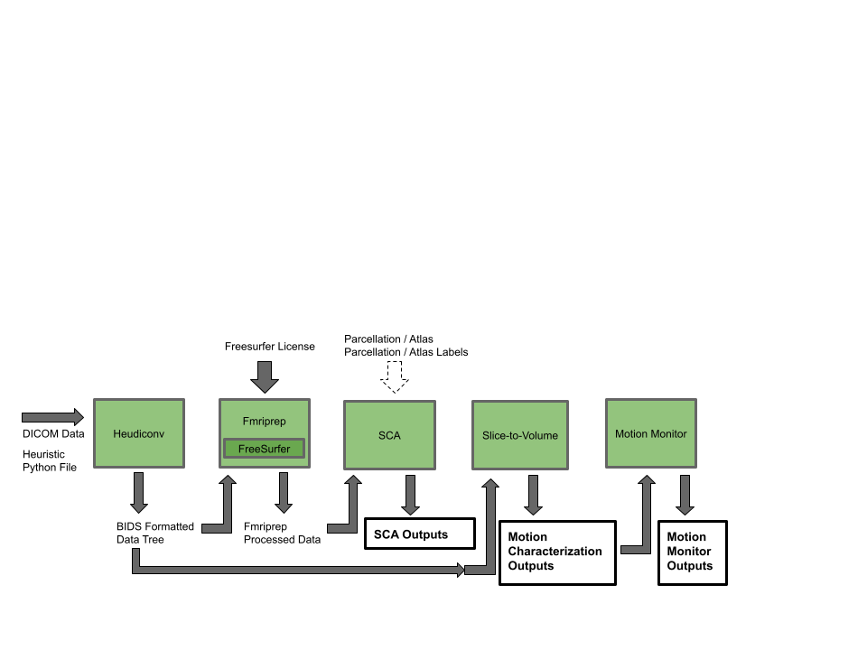

fMri Resting State Analysis Pipeline Dcumentation
===================================

**fmri-rest-pipe** fMRI Resting State Analysis Pipeline is an analysis pipeline desinged to strategically and simply run region based correlation and motion analysis based upon sorted DICOM data. This pipeline will return a seed-based correlation analysis based upon the NiLearn
wrapper as well as a slice-to-volume based motion analysis of a set of DICOM
formatted data.

Overview of Pipeline Processes
~~~~~~~~~~~~~~~~~~~~~~~~~~~~~~

Contents
--------

.. toctree::

   index
   requirements
   usage
   outputs
